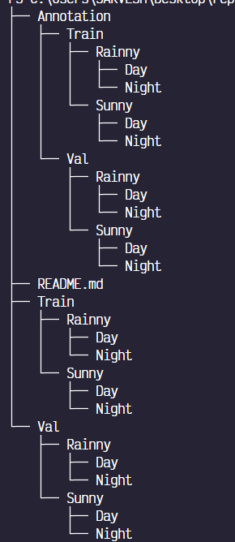
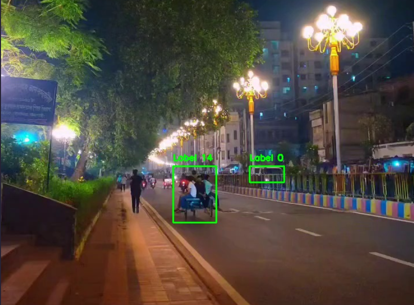
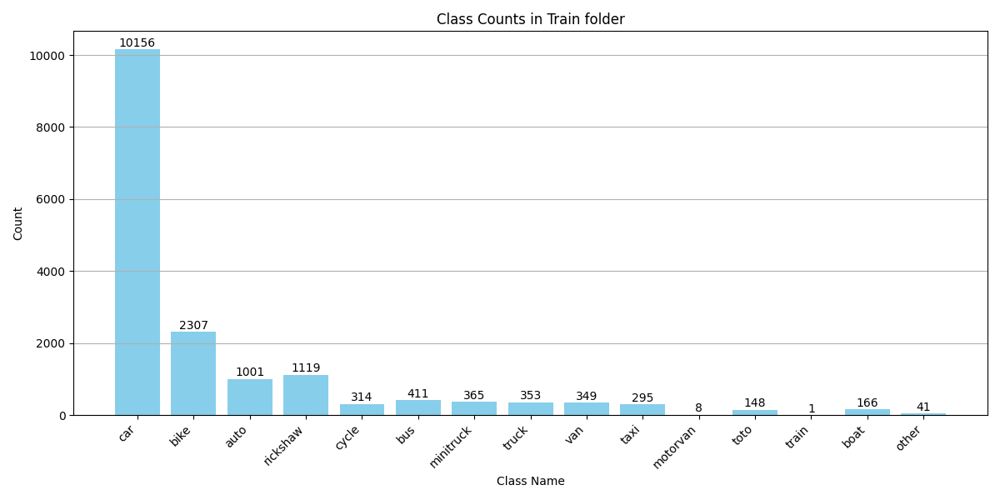
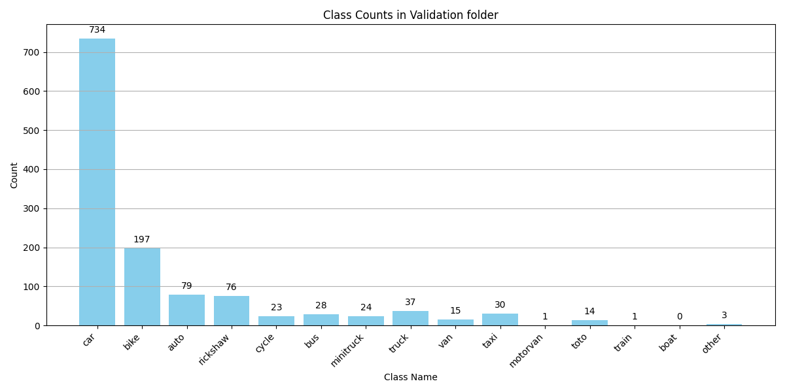

# ICDEC 2024 Challenge: Vehicle Detection in Various Weather Conditions(VDVWC)

A YOLO (You Only Look Once) based model trained on the limited personal dataset given here : [dataset_link](https://github.com/Sourajit-Maity/juvdv2-vdvwc.git)

---

### DIRECTORY STRUCTURE

Let us discuss about the directory structure which we will be working on

This is the directory structure of the dataset which was given



I manually altered the direcotory structure of the dataset given to all the images in `dataset/images` and all the annotation files in the folder `dataset/labels`

Made a python file titled `val_split.py` which then splits the dataset into the train and val split with 7% of the dataset being randomly selected for the validation data . I had to reduce the validation size of the originally given dataset due to the size of dataset being less .

So after the train val split this is the final dataset directory which I worked on


---

### FILE STRUCTURE

Let me explain the file and directory structure in this repo and what those files do one by one

1. `400 epochs` : this folder contains the results from the 400 epochs run on the raw dataset , the YOLO model used in this was the yolov8n
2. `After augmentation model`: this folder contains the results with the model file of the yolov8n model trained for 400 epochs on the augmented dataset
3. `graphs`: this folder contains the countplots of the train and val folder classes before and after the augmentation
4. `image/README`: this folder contains the images used inside the readme file
5. `runs/detect`: pls ignore this folder
6. `app.py` : this file helps to label the classes on any video , just replace the video file path and then run the following code

   ```python
   python run app.py
   ```
7. `config.yaml` : this file is the configuration file for the yolo model if you want to run it locally
8. `countplot.py`: this file is for making the countplto and saving it in the graphs folder.
9. `cut_paste_augmentation.py` : this python file is for augmenting the dataset and save the respective annotations with     			correct file names .
10. `directory.py` python file used to print out the directory structure
11. `dataset.yaml` : used for finding the results locally
12. `kaggle_config.yaml`: configuration file used for training the yolo model on the kaggle platform
13. `val_split.py` python file used to split the dataset into train and validation randomly

---

### CLASSES

The total classes according to the given dataset were 14 , given as below :

0. `car`
1. `bike`
2. `auto`
3. `rickshaw`
4. `cycle`
5. `bus`
6. `minitruck`
7. `truck`
8. `van`
9. `taxi`
10. `motorvan`
11. `toto`
12. `train`
13. `boat`

But when I tried to load the `config.yaml` file and train the yolo model , it throwed me an error , it was related to finding the class number 14 in the annotations dataset , after checking the dataset manually there were a few images which contained an extra class which was not mentioned in the dataset which was given . After plotting the labels on the images with the help of given annotations , this was the class number 14 which was found in the dataset



Did some research , checked some other images as well , I found out that this class is for the objects which are not general like in the above image we can see that the object 14 isnt something which we see in our day to day life , So I made some changes in the yaml file and marked object number 14 as `other` category

---

### DATASET IMBALANCE

The dataset was quite imbalanced  , The `car` class had much more images than the other classes . Here is a basic visualization which shows the class imbalance





This high imbalance might lead to model bias which might not work great with the unseen data

---

### YOLO MODEL WITH CLASS IMBALANCE

First of all , lets see how does the model performs with the class imbalances present in the dataset through the confusion matrix which might be the best way right now to judge if model is performing well or not


Some of the points which I could figure out for the low performance of the model :

* Class Imbalance : The class `car` was predicted for the background images also due the model which was trained heavily on the car class due to the class imbalance which i showed you earlier which is in the train and the validation folder
* Less Dataset : The dataset was very less.

---

### DATA AUGMENTATION AND PREPROCESSING

For the data augmentation part due to the class imbalance I did the cut paste augmentation with poison blending

Let me give you the basic over view of the cutpaste augmentation through the basic visualization


in this augmentation what we did was to select the classes cut them through their bounding boxes given in the first image , and then paste it inside the 2nd image , for the 2nd image to not look so unnatural what I did was to place the object in such a way that its relatively placed near the other objects

for the images to blend with the other image , we did poisson blending , which basically makes the image look more natural and blended inside the 2nd image .

---
