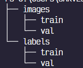

# ICDEC 2024 Challenge: Vehicle Detection in Various Weather Conditions(VDVWC)

A YOLO (You Only Look Once) based model trained on the limited personal dataset given here : [dataset_link](https://github.com/Sourajit-Maity/juvdv2-vdvwc.git)

---

### DIRECTORY STRUCTURE

Let us discuss about the directory structure which we will be working on

This is the directory structure of the dataset which was given

I manually altered the direcotory structure of the dataset given to all the images in `dataset/images` and all the annotation files in the folder `dataset/labels`

Made a python file titled `val_split.py` which then splits the dataset into the train and val split with 7% of the dataset being randomly selected for the validation data . I had to reduce the validation size of the originally given dataset due to the size of dataset being less .

So after the train val split this is the final dataset directory which I worked on

---

### CLASSES

The total classes according to the given dataset were 14 , given as below :

0. `car`
1. `bike`
2. `auto`
3. `rickshaw`
4. `cycle`
5. `bus`
6. `minitruck`
7. `truck`
8. `van`
9. `taxi`
10. `motorvan`
11. `toto`
12. `train`
13. `boat`

But when I tried to load the `config.yaml` file and train the yolo model , it throwed me an error , it was related to finding the class number 14 in the annotations dataset , after checking the dataset manually there were a few images which contained an extra class which was not mentioned in the dataset which was given . After plotting the labels on the images with the help of given annotations , this was the class number 14 which was found in the dataset

Did some research , checked some other images as well , I found out that this class is for the objects which are not general like in the above image we can see that the object 14 isnt something which we see in our day to day life , So I made some changes in the yaml file and marked object number 14 as `other` category

---

### DATASET IMBALANCE

The dataset was quite imbalanced  , The `car` class had much more images than the other classes . Here is a basic visualization which shows the class imbalance

This high imbalance might lead to model bias which might not work great with the unseen data

---

### YOLO MODEL WITH CLASS IMBALANCE

First of all , lets see how does the model performs with the class imbalances present in the dataset through the confusion matrix which might be the best way right now to judge if model is performing well or not

Some of the points which I could figure out for the low performance of the model :

* Class Imbalance : The class `car` was predicted for the background images also due the model which was trained heavily on the car class due to the class imbalance which i showed you earlier which is in the train and the validation folder
* Less Dataset : The dataset was very less.

---

### DATA AUGMENTATION AND PREPROCESSING

For the data augmentation part Due to the class imbalance I did the 

---

If the image is not visible or isnt clear, here's the link for the excalidraw notebook with other comparisions as well : [Excalidraw_notebook ](https://excalidraw.com/#json=N0QYiNPK9x-QPxrEU3Izt,em0B7E7QtfhwAaLFPTn84w)
